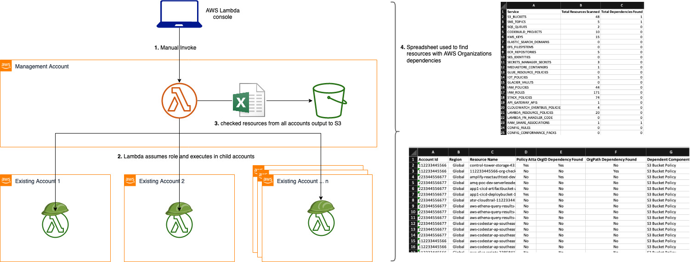

Copyright Amazon.com, Inc. or its affiliates. All Rights Reserved.
SPDX-License-Identifier: MIT-0

<> This solution is now deprecated. For the AWS Solution, please refer Account Assessment for AWS Organizations: https://aws.amazon.com/solutions/implementations/account-assessment-for-aws-organizations/

# Purpose
Many enterprise customers use AWS Organizations for the management of AWS Accounts and often times they come across a scenario when there is a need to migrate AWS Accounts from one AWS Organization to another AWS Organization.

AWS Organizations helps you centrally manage and govern your environment as you grow and scale your AWS resources. In addition, AWS Organizations is integrated with other AWS services so you can define central configurations, security mechanisms, audit requirements, and resource sharing across accounts in your organization. As we work with customers who may have an acquisition use case or a need to move from one AWS Organization to another, they ask "what can break?"

There are a few things that must be considered for analyzing the impact when migrating AWS Accounts from one AWS Organization to another: So, during the course of migrating AWS Accounts from one AWS Organization to another it is imperative to understand the central configurations, organizational dependencies and assess the environment before the actual migration.

# AWS Organizations dependency checker

This repository provides the automation to check for references to Organizational resources in policies across some or all the accounts in an AWS Organization. Specifically, the tool looks for `aws:PrincipalOrgID` and `PrincipalOrgPaths` - see documentation here docs for those [here](https://docs.aws.amazon.com/IAM/latest/UserGuide/reference_policies_condition-keys.html#condition-keys-principalorgid).  This is used in analyzing the dependencies when AWS Accounts are migrated from one AWS Organization to another. Please review the [Customer Advisory](https://github.com/aws-samples/check-aws-resources-for-org-conditions/blob/main/Customer_Advisory.md) before using the Dependency Checker.




This repository will provide the 
1. CloudFormation template to deploy the IAM role via stacksets to all accounts in the Org (required by lambda to assume)
2. SAM application to:
    1. Deploy Lambda function for scanning the AWS Resources for Org Id and Org Path conditions
    2. Create S3 bucket for storing generated reports
    3. Deploy role for lambda to assume to master account.

## Deployment

For ease of deployment, the architecture has been wrapped into an [AWS SAM](https://docs.aws.amazon.com/serverless-application-model/latest/developerguide/serverless-getting-started.html) application.

### Pre-requisites

* [SAM CLI installed](https://docs.aws.amazon.com/serverless-application-model/latest/developerguide/serverless-sam-cli-install.html)
* [AWS CLI installed](https://docs.aws.amazon.com/cli/latest/userguide/install-cliv2.html) (with credentials/profile set for the master account of the AWS Organization)

### Add policy to IAM user

The following [IAM policy](IAM_Policy.json) should be assigned to the IAM user or role which will be used to execute the included dependency scanner code. The goal of this policy is to limit create/update/delete actions from being performed on any AWS resources other than the specific named resources that the dependency scanner code will itself need to deploy. Please carefully review this policy with your own security and/or access teams to ensure no additional safeguards are required.

### Deploy SAM application to master account

Build and Deploy:
- First build the app: 
  ```
  sam build
  ```
  (if using Windows, use the `--use-container` option to the above command)

- Ensuring you are using credentials for the master account of the Org, deploy the app using the guided mode: 
  ```bash
  sam deploy -g --capabilities CAPABILITY_NAMED_IAM
  ```
    Follow the prompts to deploy the application. Name the application `org-dep-checker`

    Make a note of the value of `LambdaRole` which is output after successful stack deployment.

### Deploy role to Org accounts

The SAM application deploys a lambda which needs to assume a role in the accounts within your Org. This role needs to exist. Deploy this role to multiple accounts by creating a StackSet within the master account.

The quickest and most customisable way to do this is via the CloudFormation console

1. Open the CloudFormation Console
1. Click "StackSets" in the left pane
1. Click "Create StackSet" in the centre pane
1. Choose "Upload template file" and then select `org-dep-checker-role-stackset.yaml` from this repository, then "Next"
1. For stackset name, enter "org-dep-checker-role" 
1. For parameter "LambdaRole", enter the ARN noted from the output of the `sam deploy` command named `LambdaRole` (or alternatively, navigate to the Output of the cfn stack in CloudFormation console for the SAM app). Click "Next"
1. In Step 3, leave "Service Managed Permissions" checked, and click "Next"
1. In Step 4, leave deployment targets as "Deploy to Organization". This will deploy the role to all accounts in the Org. Alternatively, you can specify individual OUs instead of all the Org.
1. Specify the regions, eg. ap-southeast-2 and ap-southeast-1
1. Optionally change the concurrent accounts and failure tolerance as desired.
1. Click "Next", Review config, then "Submit"

## Usage

The lambda trigger is manual, and therefore the easiest initiation is via the AWS Lambda console.

It can take some time to analyse each account, and therefore alhough it is possible to run against all accounts in the Org, it is suggested to specify lists of accounts instead. Otherwise there is a risk of hitting the 15 min timeout. This option be configured via lambda Env Vars (see next section)

### Configuring the lambda

1. Navigate to the AWS Lambda console, choose "Functions" in left pane 
1. Find function beginning with `org-dep-checker` and select
1. In the function window, click on tab "Configuration", then "Environment Variables"
1. *If you wish* to run on all accounts, set `USE_ORG_FOR_ACCOUNT_LIST` to true. 
1. *Recommended:* Set `USE_ORG_FOR_ACCOUNT_LIST` to false, and enter accounts in `ACCOUNT_LIST` as comma separated string. Start with one account to test everything is ok.

### Executing the lambda

In the lambda console:
1. Navigate to the `Code` tab
1. Click "Test". 
1. For payload, enter any name (eg. 'test') and hit "Save". There is no payload needed but one is required to execute.
1. Click "Test" to execute the code.
1. Monitor the progress through the lamdba console, or in realtime through CloudWatch logs (click on "Monitor" tab and "View logs in CloudWatch")
1. Once complete, results are stored in S3 in bucket `_accountid_-org-check-resource-reports` (where _accountID_ is the mgmt account id)

### Reading the reports

The CSV / XLS files generated contain a column for `OrgPath Dependency Found` and `OrgPath Dependency Found`

If any row has this set to True, then a plan needs to be put in place for migration of this account. When removing from the existing Org these resources will be affected.

Important to know: Please find the list of AWS Services that support resource based policies https://docs.aws.amazon.com/IAM/latest/UserGuide/reference_aws-services-that-work-with-iam.html#deploy_svcs 
